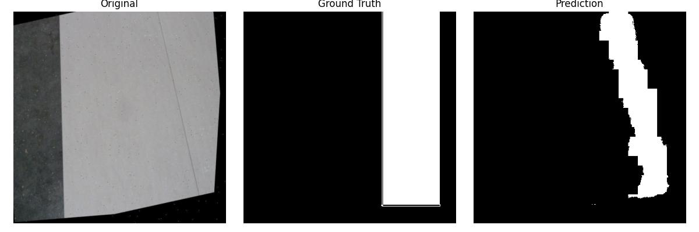
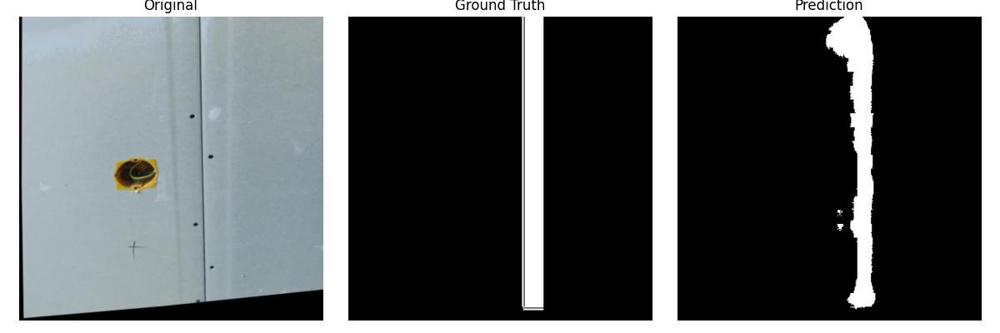
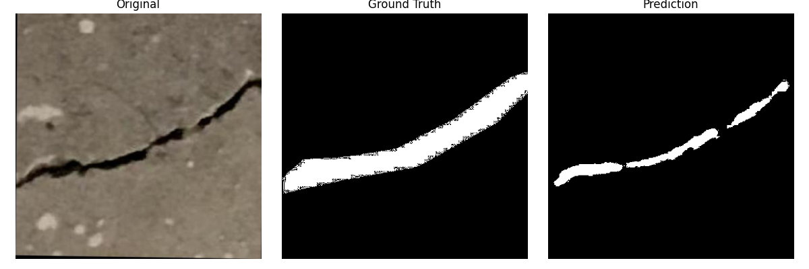
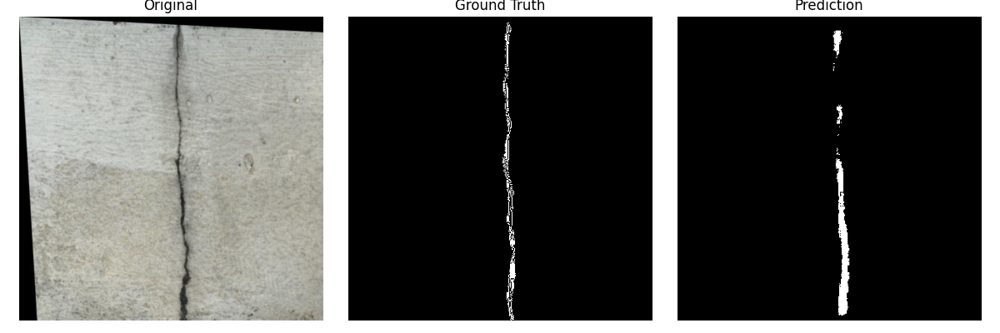

# Text-Prompted Segmentation

This repository contains the implementation of a text-prompted segmentation framework using the **CLIPSeg** model. Given an image and a natural language prompt, the model predicts a binary mask corresponding to the requested object or region (e.g., cracks, drywall seams, taping areas).

---

## 1. Project Goal

The goal of this project is to predict segmentation masks for different prompts using image samples. Specifically, the model supports:

- **Cracks Dataset**: Prompts like `"segment crack"` and `"segment wall crack"`.
- **Drywall Taping Dataset**: Prompts like `"segment taping area"`, `"segment joint/tape"`, `"segment drywall seam"`.

Predicted masks are single-channel PNGs with values `{0, 255}`.

---

## 2. Environment Setup

A Conda environment file `text_seg.yml` is provided with all required dependencies.

1. **Create the environment**:
```bash
conda env create -f text_seg.yml

conda activate clipseg
```
## Download Datasets
```bash


Create a `data/` folder and download the datasets from Roboflow:

- **Drywall-Join-Detect (Taping Area)**  
  [Dataset Link](https://universe.roboflow.com/objectdetect-pu6rn/drywall-join-detect)

- **Cracks Dataset**  
  [Dataset Link](https://universe.roboflow.com/fyp-ny1jt/cracks-3ii36)

```

After downloading, organize the images and masks in the following folder structure:
```bash
data/
├── drywall_taping/
│ ├── images/
│ └── masks/
├── cracks/
│ ├── images/
│ └── masks/
```

## Running the Pipeline  

For data parsing, training, inference, and visualizations, run the following scripts:

```bash
# Parse the dataset and generate masks
python3 dataparser_cracks.py  

# Train the model, run inference, and generate visualizations
python text_segmentation_cracks.py  
```

## Qualitative Results

Below are some sample visualizations showing **Original Image | Ground Truth | Predicted Mask**.

### Drywall Taping Segmentation

<p align="center">
  <div style="display: flex; justify-content: center; gap: 30px;">
    <div align="center">
      
      <p>Prompt: segment drywall seam</p>
    </div>
    <div align="center">
      
      <p>Prompt: segment taping area</p>
    </div>
  </div>
</p>

### Crack Segmentation

<p align="center">
  <div style="display: flex; justify-content: center; gap: 30px;">
    <div align="center">
      
      <p>Prompt: segment crack</p>
    </div>
    <div align="center">
      
      <p>Prompt: segment wall crack</p>
    </div>
  </div>
</p>
